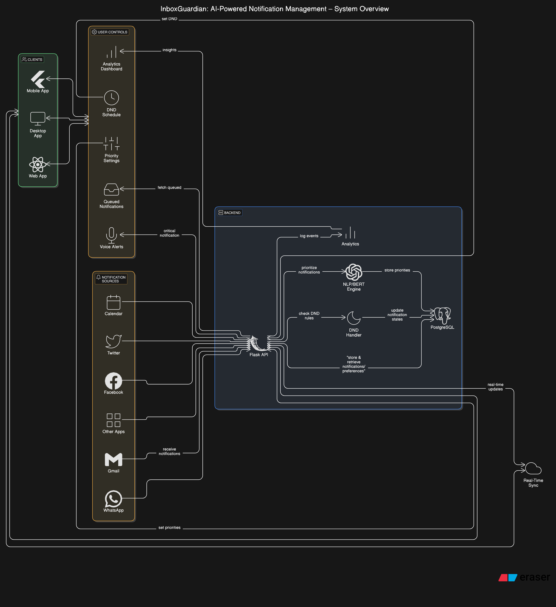

# **InboxGuardian**

### **Protect Your Focus, Prioritize Your Day**

InboxGuardian is an AI-powered notification management app that helps you stay productive by prioritizing your notifications, enabling distraction-free Do Not Disturb (DND) modes, and syncing seamlessly across devices. Whether you're working, studying, or just need a break from interruptions, InboxGuardian ensures you only see what's important.

---

## **Features**
- **AI-Powered Notification Prioritization**:
  - Categorizes notifications into High, Medium, and Low priority using NLP models.
- **Customizable Do Not Disturb Mode**:
  - Block distractions and queue notifications during specified timeframes.
- **Real-Time Voice Alerts**:
  - Receive instant voice notifications for critical updates.
- **Cross-Platform Synchronization**:
  - Seamlessly sync notifications across Android, desktop, and web.
- **Analytics Dashboard**:
  - Gain insights into your notification habits and productivity trends.

---

## **Workflow Diagram**
Below is the flowchart showcasing InboxGuardian's architecture and workflow:



---

## **Architecture Overview**

- **Backend**:
  - Flask-based API for managing notifications and user preferences.
  - PostgreSQL database to store notification states and DND settings.
  - AI-driven notification prioritization using NLP models (e.g., BERT).

- **Frontend**:
  - Built with Flutter for mobile and desktop compatibility.
  - Responsive web interface designed using React.js.

- **Synchronization**:
  - Real-time device sync using cloud-based APIs and delta-sync mechanisms.

---

## **Getting Started**

### **Prerequisites**
- Install Python 3.9+ for the backend.
- Install Flutter SDK for the frontend.
- Install PostgreSQL for the database.

### **Setup Instructions**

1. **Clone the Repository**:
   ```bash
   git clone https://github.com/your-username/inboxguardian.git
   cd inboxguardian
   ```

2. **Backend Setup**:
   - Navigate to the backend folder:
     ```bash
     cd backend
     ```
   - Install dependencies:
     ```bash
     pip install -r requirements.txt
     ```
   - Set up the database:
     - Create a PostgreSQL database named `inboxguardian`.
     - Configure the connection in `config/database_config.py`.
   - Run the Flask server:
     ```bash
     python run.py
     ```

3. **Frontend Setup**:
   - Navigate to the frontend folder:
     ```bash
     cd frontend
     ```
   - Install dependencies:
     ```bash
     flutter pub get
     ```
   - Run the app:
     ```bash
     flutter run
     ```

---

## **How It Works**
1. **Notification Reception**:
   - Notifications are received from connected platforms (Gmail, WhatsApp, etc.).
2. **AI Prioritization**:
   - Notifications are analyzed by an NLP model and assigned priority levels.
3. **DND Execution**:
   - If DND mode is active, notifications are blocked or queued for later delivery.
4. **Sync Across Devices**:
   - Notifications and settings are synchronized in real time across all devices.

---

## **Project Structure**
```
inboxguardian/
├── backend/
│   ├── app/
│   │   ├── __init__.py
│   │   ├── models.py
│   │   ├── routes.py
│   └── config/
│       ├── database_config.py
│   ├── requirements.txt
│   └── run.py
├── frontend/
│   ├── lib/
│   │   ├── main.dart
│   │   ├── screens/
│   │   └── widgets/
│   ├── pubspec.yaml
│   └── README.md
└── README.md
```

---

## **Team Details**
Meet the brilliant team behind InboxGuardian:

### **Harshit (Member 1)**:
- **Role**: Backend Developer
- **Responsibilities**:
  - Designed and developed APIs for notification management.
  - Implemented AI-powered NLP models for prioritization.
  - Set up database schema and ensured smooth backend operations.

### **Laxmi Kapoor (Member 2)**:
- **Role**: Frontend Developer
- **Responsibilities**:
  - Created responsive UI/UX for mobile and desktop platforms.
  - Integrated backend APIs into the frontend.
  - Designed branding elements like logo and app themes.

---

## **Contributing**
We welcome contributions to enhance InboxGuardian! Here's how you can contribute:
1. Fork the repository.
2. Create a feature branch:
   ```bash
   git checkout -b feature-name
   ```
3. Commit your changes:
   ```bash
   git commit -m "Add your message here"
   ```
4. Push your branch and create a pull request.

---

## **License**
This project is licensed under the MIT License. See `LICENSE.md` for details.

---

## **Contact**
- **Name**: Harshit
- **Email**: [rarchit101@gmail.com](mailto:your-email@example.com)
- **GitHub**: [https://github.com/Zukliod](https://github.com/Zukliod)
